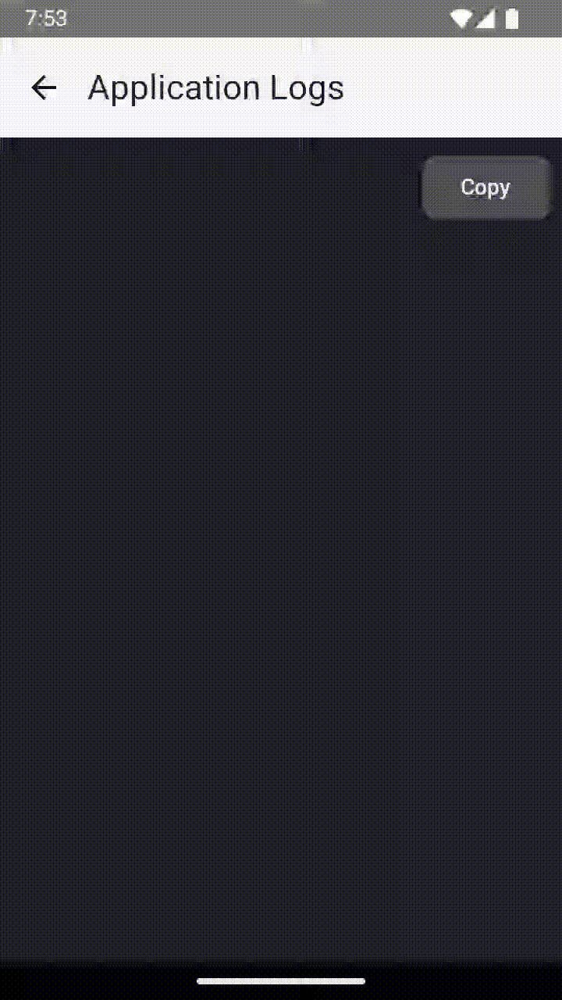
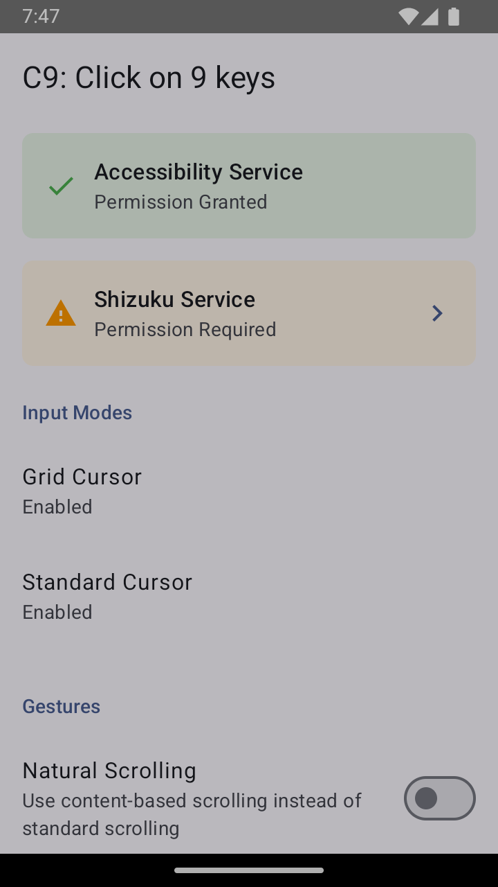
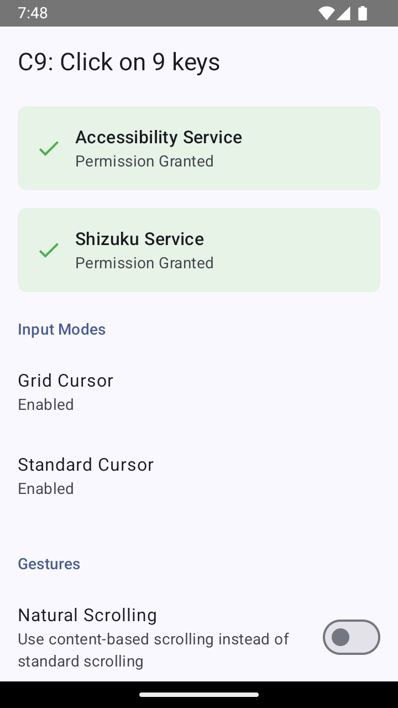

<div align="center">

</div>

---

# C9: Click on 9 keys
   

<div align="center">


</div>

C9 is a dual-cursor application that takes inspiration from T9 to provide clicks using the numpad on Android feature phones. Features of the application include:

- 🤖 Android 8.0+ support
- 🌎 Universal Android 11 compatibility via Shizuku as needed
- ⚡ Introduction of a grid cursor focused on efficiency
- 🖱️ Standard cursor to provide a traditional proxy for touchscreen gestures
- ⚙️ Remappable cursor activation keys and integration with button mappers
- 🔀 Translation of key presses into near-native taps, double taps, long press (and drag), scrolling, and zoom
- ✨ Additional quality-of-life features such as landscape orientation support and cursor auto-hide in text fields

## Table of Contents
- [Overview](#overview)
  - [Grid Cursor](#grid-cursor)
    - [Instructions](#instructions)
  - [Standard Cursor](#standard-cursor)
    - [Instructions](#instructions-1)
- [Recommendations](#recommendations)
- [Installation](#installation)
- [Troubleshooting](#troubleshooting)
- [Known Issues](#known-issues)
- [FAQs](#faqs)
- [License](#license)
- [Acknowledgment](#acknowledgments)

## Overview
Because of their different navigation paradigms, each cursor mode maps gestures uniquely as will be shown below. While both modes can be **enabled** simultaneously (by mapping their activation key or shortcut), only one cursor can be **active** at a time. As a final note, <ins>all buttons in the numpad and D-pad are generally reserved/intercepted while the cursor is active</ins>.

The following options can be configured, which affects scrolls and zooms in both modes:
- Natural scrolling
- Gesture visualizations
- Gesture style
  - `Fixed`: Gestures are controlled and fixed distance.
  - `Inertia`: Gestures resemble touchscreen flicks.
- Gesture duration
- Scroll distance

Additionally, the following options can be configured to adjust the behavior of the cursors:
- Auto-hide in text fields

The following options cannot be configured but are enabled:
- Continuous scrolling
  - Regardless of the gesture style used for single scrolls, continuous scrolling will use the `Fixed` gesture style.

### Grid Cursor
<br />

<div align="center">

</div>

<br />

The grid cursor trades precision for efficiency, taking advantage of the fact that many interactions with UI elements do not require pixel-by-pixel precision. `n` grid levels produce `9^n` points onscreen that can be reached with at most `n` numpad clicks. The visualizations below show the points that can be reached with two grid levels/clicks (81 points), three grid levels/clicks (729 points), and four grid levels/clicks (6561 points).

<br />

<div align="center">


</div>

<br />

The following options can be configured:
- Grid cursor internal activation key
- Number of grid levels
- Grid persistence after clicking in the final grid
- Grid opacity
- Grid number visibility
- Grid line visibility

#### Instructions
| Action | Mapped buttons | Gesture location | Advances grid | Notes |
| --- | --- | --- | --- | --- |
| Activate/Deactivate | Hold the internal activation key or use a button mapper to map the "Activate Grid Cursor" shortcut. | N/A | N/A | The default internal activation key is the pound (#) key. This can be remapped or unmapped internally. Avoid using buttons in the D-pad or numpad for activation, as they will clash with the gestures below. ||
| Navigate grid | Click numpad 1-9. | The selected number. | True | These buttons rotate with the screen if `C9 > Rotate Buttons With Orientation` is enabled. |
| Reset back to main grid | Press the internal activation key or use a button mapper to map the "Reset Grid" shortcut. | N/A | N/A ||
| Tap | Click numpad 1-9 in the final grid level. | The center of the selected number's cell. | True | These buttons rotate with the screen if `C9 > Rotate Buttons With Orientation` is enabled. |
| Tap | Click D-pad center. | If a number is first held, the center of its cell in the current grid. Else, center of the screen. | False ||
| Double Tap | Double click D-pad center. | If a number is first held, the center of its cell in the current grid. Else, center of the screen. | False ||
| Scroll | Click D-pad directions. Hold for continuous scrolling. | If a number is first held, the center of its cell in the current grid. Else, center of the screen. | False | These buttons rotate with the screen if `C9 > Rotate Buttons With Orientation` is enabled. |
| Zoom | Click star (*) and numpad 0. | If a number is first held, the center of its cell in the current grid. Else, center of the screen. | False ||

### Standard Cursor

<br />

<div align="center">

</div>

<br />

A standard cursor is included for actions requiring more precision and for those who strictly prefer a traditional pointer.

The following options can be configured:
- Standard cursor internal activation key
- Control scheme
  - Standard: D-pad moves, numpad scrolls
  - Swapped: D-pad scrolls, numpad moves
  - D-pad: D-pad moves and scrolls
  - Numpad: Numpad moves and scrolls
- Screen Edge Behavior
  - Enable cursor wrap around
  - Slow and continuous scrolling in the direction of the edge
- Cursor speed
- Cursor acceleration: accelerated cursor speed when held
- Cursor acceleration threshold: duration after which cursor speed is accelerated
- Cursor size and appearance

#### Instructions
All gestures are dispatched at the cursor's current location.

| Action | Mapped buttons | Notes |
| --- | --- | --- |
| Activate/Deactivate | Hold the internal activation key or use a button mapper to map the "Activate Standard Cursor" shortcut. | The default internal activation key is the star (*) key. This can be remapped or unmapped internally. Avoid using buttons in the D-pad or numpad for activation, as they will clash with the gestures below. |
| Cursor Movement | Click D-pad directions or numpad 2/4/6/8 (depends on control scheme). | These buttons rotate with the screen if `C9 > Rotate Buttons With Orientation` is enabled. |
| Tap | Click D-pad center or numpad 5. ||
| Double Tap | Double click D-pad center or numpad 5. ||
| Long Press/Drag | Hold D-pad center or numpad 5 to long press, then move cursor to drag. Release D-pad center or numpad 5 to end the gesture. ||
| Scroll | Click D-pad directions or numpad 2/4/6/8 (depends on control scheme). Hold for continuous scrolling. | These buttons rotate with the screen if `C9 > Rotate Buttons With Orientation` is enabled. |
| Zoom | Numpad 1 and 3. ||
| Toggle Move/Scroll | Press the internal activation key or use a button mapper to map the "Toggle Cursor Scroll" shortcut. | This only applies to the control schemes `D-pad` and `Numpad`. |

### Recommendations
- For precise clicks, you can use a) grid cursor mode or b) standard cursor with a low cursor speed and high cursor acceleration.
- In the standard cursor mode with the standard control scheme, it may be easier to long press numpad 5 instead of D-pad center and then press one of the D-pad directions to long press and drag.
- In the standard cursor mode, behavior at the edge of the screen can be set with `C9 > Standard Cursor > Screen Edge Behavior`.
- If `C9 > Auto-Hide in Text Fields` is set, the cursors will hide when entering a text field and automatically restore either upon leaving a text field or pressing enter (to submit a text field). The standard cursor's last position is saved upon restore.
  - Automatic restoration is cancelled if any cursor is manually activated while inside the text field.
- In the grid cursor mode, quickly navigate to the center of any cell in the current subgrid by pressing that cell's number followed by quick, successive presses of numpad 5.
- For both cursors, use `C9 > Developer Options > Use Physical Size` to choose whether or not the cursor extends over your device's status bar and navigation bar.


## Installation
The latest version can be found under [releases](https://github.com/austinauyeung/C9/releases). You can use GitHub's `Watch > Custom > Releases` option to be notified of new releases.

### Option 1
Install using the standard package installer. Allow the accessibility service using the banner in the application.

### Option 2
Install using adb:
```
>> adb install path/to/apk
>> adb shell settings put secure enabled_accessibility_services com.austinauyeung.nyuma.c9/com.austinauyeung.nyuma.c9.accessibility.service.OverlayAccessibilityService
```

### Additional installation for Android 8
If you are on Android 8 and are experiencing poor scrolling performance, Shizuku may be required. Please see the next section for Shizuku guidelines.

### Additional installation for Android 11
If you are on Android 11, please first try the application as-is. If gestures cannot be dispatched successfully, or if you have had trouble in the past with other cursor apps, you will need to [install Shizuku](https://shizuku.rikka.app/guide/setup/) to use this application. Once installed, navigate to, and enable, `C9 > Developer Options > Enable Shizuku Integration`.

Note that unless your device is rooted, you will need to restart the Shizuku service upon reboot.

## Troubleshooting
### Generating cursor logs
<div align="center">

</div>

If gestures do not work as expected, logs can be generated to help identify and fix any issues. Navigate to `C9 > Developer Options > Log Screen`, activate the cursor, and perform the corresponding gesture(s). Copy the logs and submit a GitHub issue. The example logs below correspond to the screen recording above.

```
--- SYSTEM INFORMATION ---
Device: Google sdk_gphone64_x86_64
Android Version: 15 (SDK 35)
Screen: 720 x 1232 pixels (density 2.0)

--- USER SETTINGS ---
...

--- LOG ENTRIES ---
[19:53:58.362] [D] Key event: KeyEvent { action=ACTION_DOWN, keyCode=KEYCODE_EQUALS, scanCode=13, metaState=0, flags=0x8, repeatCount=0, eventTime=14387767052000, downTime=14387767052000, deviceId=0, source=0x301, displayId=-1 }
[19:53:58.665] [D] Overlay mode changed: NONE -> CURSOR
[19:53:58.669] [D] Cursor state changed: true
[19:53:58.682] [D] Overlay view created and added to window manager
[19:53:58.886] [D] Key event: KeyEvent { action=ACTION_UP, keyCode=KEYCODE_EQUALS, scanCode=13, metaState=0, flags=0x8, repeatCount=0, eventTime=14388291421000, downTime=14387767052000, deviceId=0, source=0x301, displayId=-1 }
[19:53:59.716] [D] Key event: KeyEvent { action=ACTION_DOWN, keyCode=KEYCODE_ENTER, scanCode=28, metaState=0, flags=0x8, repeatCount=0, eventTime=14389121655000, downTime=14389121655000, deviceId=0, source=0x301, displayId=-1 }
[19:53:59.717] [D] Starting tap gesture at (360.0, 640.0)
[19:53:59.718] [D] DefaultGestureStrategy: starting tap at (360.0, 640.0)
[19:53:59.718] [D] Gesture paths changed: 1 paths
[19:53:59.746] [D] DefaultGestureStrategy: start tap completed successfully
[19:53:59.771] [D] Gesture paths changed: 0 paths
[19:53:59.798] [D] Key event: KeyEvent { action=ACTION_UP, keyCode=KEYCODE_ENTER, scanCode=28, metaState=0, flags=0x8, repeatCount=0, eventTime=14389190365000, downTime=14389121655000, deviceId=0, source=0x301, displayId=-1 }
[19:53:59.799] [D] Ending tap at (360.0, 640.0)
[19:53:59.799] [D] DefaultGestureStrategy: ending tap at (360.0, 640.0)
[19:53:59.808] [D] DefaultGestureStrategy: end tap completed successfully
[19:54:01.307] [D] Key event: KeyEvent { action=ACTION_DOWN, keyCode=KEYCODE_EQUALS, scanCode=13, metaState=0, flags=0x8, repeatCount=0, eventTime=14390712608000, downTime=14390712608000, deviceId=0, source=0x301, displayId=-1 }
[19:54:01.609] [D] Overlay mode changed: CURSOR -> NONE
[19:54:01.612] [D] Cursor state changed: false
[19:54:01.626] [D] Overlay view removed
[19:54:01.875] [D] Key event: KeyEvent { action=ACTION_UP, keyCode=KEYCODE_EQUALS, scanCode=13, metaState=0, flags=0x8, repeatCount=0, eventTime=14391281290000, downTime=14390712608000, deviceId=0, source=0x301, displayId=-1 }
[19:54:02.231] [D] Key event: KeyEvent { action=ACTION_DOWN, keyCode=KEYCODE_DPAD_RIGHT, scanCode=106, metaState=0, flags=0x8, repeatCount=0, eventTime=14391636575000, downTime=14391636575000, deviceId=0, source=0x301, displayId=-1 }
[19:54:02.322] [D] Key event: KeyEvent { action=ACTION_UP, keyCode=KEYCODE_DPAD_RIGHT, scanCode=106, metaState=0, flags=0x8, repeatCount=0, eventTime=14391727695000, downTime=14391636575000, deviceId=0, source=0x301, displayId=-1 }
[19:54:02.869] [D] Key event: KeyEvent { action=ACTION_DOWN, keyCode=KEYCODE_DPAD_RIGHT, scanCode=106, metaState=0, flags=0x8, repeatCount=0, eventTime=14392275611000, downTime=14392275611000, deviceId=0, source=0x301, displayId=-1 }
[19:54:02.950] [D] Key event: KeyEvent { action=ACTION_UP, keyCode=KEYCODE_DPAD_RIGHT, scanCode=106, metaState=0, flags=0x8, repeatCount=0, eventTime=14392344310000, downTime=14392275611000, deviceId=0, source=0x301, displayId=-1 }
[19:54:03.460] [D] Key event: KeyEvent { action=ACTION_DOWN, keyCode=KEYCODE_ENTER, scanCode=28, metaState=0, flags=0x8, repeatCount=0, eventTime=14392865662000, downTime=14392865662000, deviceId=0, source=0x301, displayId=-1 }
[19:54:03.507] [D] Key event: KeyEvent { action=ACTION_UP, keyCode=KEYCODE_ENTER, scanCode=28, metaState=0, flags=0x8, repeatCount=0, eventTime=14392912821000, downTime=14392865662000, deviceId=0, source=0x301, displayId=-1 }

```

### Verifying Shizuku authorization
A green banner on the main page indicates that Shizuku authorization has been granted to C9. Only the third screenshot below indicates successful authorization.
<div align="center">



</div>

### Cursor does not deactivate
If you are unable to deactivate the cursor, clear the internal activation key, which unmaps that cursor and hides any active cursor, even if it was activated using a button mapper.

## Known Issues
- On the Vortex V3, the numpad backlight may not function when the cursor is active.
  - This is likely due to the cursors' interception of key presses. There is an experimental setting "Allow Passthrough" that may fix this at the expense of unintended behavior in the underlying application.
- With Shizuku enabled and a `Fixed` gesture style, pull to refresh (e.g. scrolling down at the top of a page inside a browser that supports this feature) does not work.
  - This is currently unavoidable due to the implementation of this gesture style with Shizuku. Use either long press and drag or the `Inertia` gesture style.

## FAQs
### Where can I make feature suggestions or report bugs?
Thanks for using and testing C9! You can use the [issues](https://github.com/austinauyeung/C9/issues) tab for both. For bugs, please provide logs using the built-in logger (see [Generating cursor logs](#generating-cursor-logs)) or `adb logcat C9App:V *:S`.

### How else can I contribute?
Please feel free to submit a pull request, create a video walkthrough, or provide anything else you think would be helpful!

### What is Shizuku?
Shizuku allows applications in general to perform actions that require elevated privileges. In C9, it is required to dispatch gestures on Android 11 using [InputManager](https://developer.android.com/reference/android/hardware/input/InputManager) instead of the standard dispatch using [AccessibilityService](https://developer.android.com/reference/android/accessibilityservice/AccessibilityService).

### What does it mean for the cursor to intercept button presses?
The cursors sit between your button presses and the underlying application. If a button is used by the cursor, the cursor will consume it and prevent the underlying application from receiving the button press.

## License
[Apache License Version 2.0](./LICENSE)

## Acknowledgments
- Allegra, [Arlie](./docs/imgs/IMG_5199.jpg), and [Nyuma](./docs/imgs/IMG_3226.jpg) for their support
- Everyone on the [releases](https://github.com/austinauyeung/C9/releases) page for their feature suggestions
- `sam-club` for extensive testing
- `Dev-in-the-BM` for testing and the Shizuku suggestion
- `anonymousfliphones` for testing