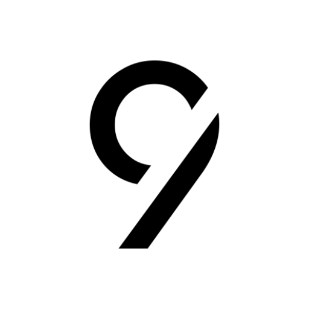
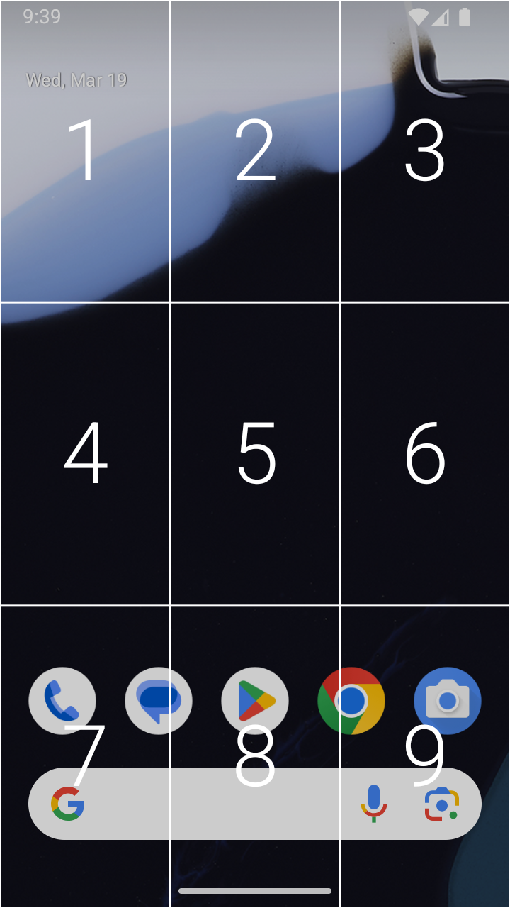
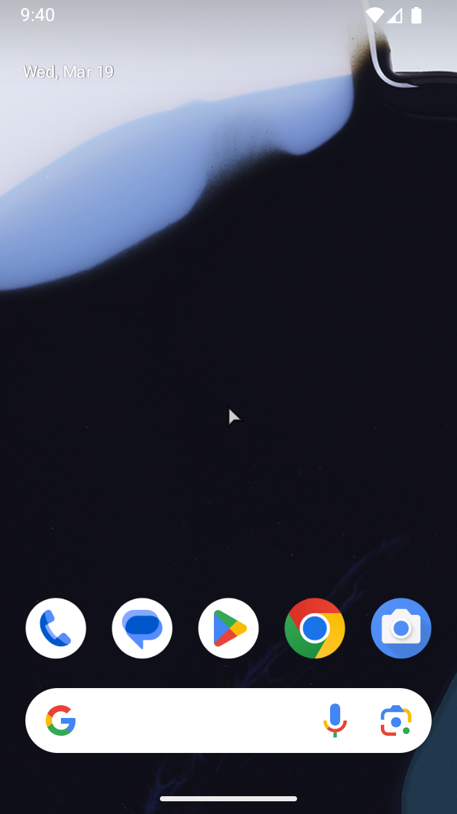
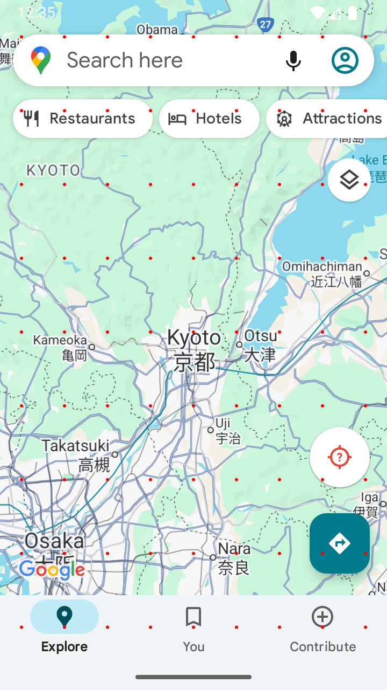
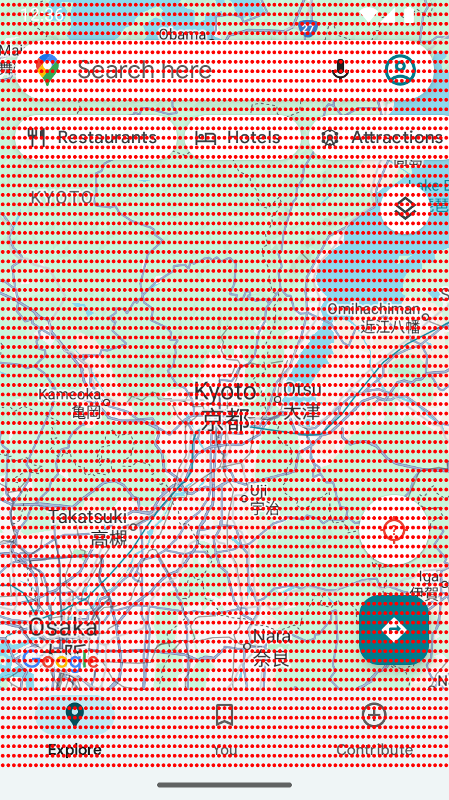

<div align="center">

</div>

---

# C9: Click on 9 keys
   

<div align="center">


</div>

C9 is a dual-cursor application that takes inspiration from T9 to provide clicks using the numpad on Android feature phones. The primary features of the application include:

- 🤖 Android 8.0+ support
- 🌎 Universal Android 11 compatibility via Shizuku as needed
- ⚡ Introduction of a grid cursor focused on efficiency
- 🖱️ Standard cursor to provide a traditional proxy for touchscreen gestures
- ⚙️ Remappable cursor activation keys
- 🔀 Translation of key presses into near-native taps, double taps, long press (and drag), scrolling, and zoom

## Overview
Because of their different navigation paradigms, each cursor mode maps gestures uniquely. While both modes can be enabled simultaneously, only one cursor can be active at a time. The following options can be configured, which affects scrolls and zooms in both modes:
- Natural scrolling
- Gesture visualizations
- Gesture style
  - Fixed: gestures are controlled and fixed distance
  - Inertia: gestures resemble touchscreen flicks
- Gesture duration
- Scroll distance

### Grid Cursor

<br />

<div align="center">

</div>

<br />

The grid cursor trades precision for efficiency. `n` grid levels produce `9^n` points onscreen that can be reached with at most `n` numpad clicks. The visualizations below show the points that can be reached with two grid levels/clicks (81 points), three grid levels/clicks (729 points), and four grid levels/clicks (6561 points).

<br />

<div align="center">



</div>

<br />

The following options can be configured:
- Grid cursor activation key
- Number of grid levels
- Grid persistence after clicking in the final grid
- Grid opacity
- Hide grid numbers

#### Usage
| Gesture | Mapped buttons | Dispatch location | Advances grid |
| --- | --- | --- | --- |
| Navigate grid | Click numpad 1-9. | The selected number. | True |
| Tap | Click numpad 1-9 in the final grid level. | The center of the selected number's cell. | True |
| Tap | Click D-pad center. | If a number is first held, the center of its cell in the current grid. Else, center of the screen. | False |
| Double Tap | Double click D-pad center. | If a number is first held, the center of its cell in the current grid. Else, center of the screen. | False |
| Scroll | Click D-pad directions. | If a number is first held, the center of its cell in the current grid. Else, center of the screen. | False |
| Zoom | Click star (*) and pound (#). | If a number is first held, the center of its cell in the current grid. Else, center of the screen. | False |

#### Instructions
- Hold activation key to activate/deactivate (default key: #).
- When activated, press the activation key to quickly reset any grid back to the main grid.

### Standard Cursor

<br />

<div align="center">

</div>

<br />

A standard cursor is included for actions requiring more precision and for those who strictly prefer a traditional pointer.

The following options can be configured:
- Standard cursor activation key
- Control scheme
  - Standard: D-pad moves, numpad scrolls
  - Swapped: D-pad scrolls, numpad moves
  - Toggle: D-pad scrolls and moves (toggle using activation key)
- Enable cursor wrap around
- Cursor speed
- Cursor acceleration: accelerated cursor speed when held
- Cursor size

#### Usage
All gestures are dispatched at the cursor's current location:

| Gesture | Mapped buttons |
| --- | --- |
| Cursor Movement | Click D-pad directions or numpad 2/4/6/8 (depends on control scheme). |
| Tap | Click D-pad center or numpad 5. |
| Double Tap | Double click D-pad center or numpad 5. |
| Long Press/Drag | Hold D-pad center or numpad 5 to long press, then move cursor to drag. Release D-pad center or numpad 5 to end the gesture. |
| Scroll | Click D-pad directions or numpad 2/4/6/8 (depends on control scheme). |
| Zoom | Numpad 1 and 3. |

#### Instructions
- Hold activation key to activate/deactivate (default key: *).
- When activated and if in the toggle control scheme, press the activation key to toggle between cursor movement and scrolling.
- Either D-pad center or numpad 5 can be used to long press. For example, in the standard control scheme, it may be easier to long press numpad 5 instead of D-pad center and then press one of the D-pad directions to long press and drag.

## Installation
The latest version can be found under [releases](https://github.com/austinauyeung/C9/releases).

### Option 1
Install using the standard package installer. Allow the accessibility service using the banner in the application.

### Option 2
Install using adb:
```
>> adb install path/to/apk
>> adb shell settings put secure enabled_accessibility_services com.austinauyeung.nyuma.c9/com.austinauyeung.nyuma.c9.accessibility.service.OverlayAccessibilityService
```

### Additional installation for Android 11
If you are on Android 11, you will see an additional "Shizuku Service" banner. Please first try the application as-is. If gestures cannot be dispatched successfully, or if you have had trouble in the past with other cursor apps, you will need to [install Shizuku](https://shizuku.rikka.app/guide/setup/) before using this application.

Note that unless your device is rooted, you will need to restart the Shizuku service upon reboot.

## FAQs
### What is Shizuku?
Shizuku allows applications in general to perform actions that require elevated privileges. In C9, it is required to dispatch gestures on Android 11 using [InputManager](https://developer.android.com/reference/android/hardware/input/InputManager) instead of the standard dispatch using [AccessibilityService](https://developer.android.com/reference/android/accessibilityservice/AccessibilityService).

### Where can I report bugs?
Thanks for using and testing C9! If possible, provide logs from `adb logcat C9App:V *:S` and use the [issues](https://github.com/austinauyeung/C9/issues) tab on GitHub. Otherwise, please post on the forum on which you discovered this app.

### How can I contribute?
Aside from bug reports, please feel free to make feature suggestions or pull requests.

## License
[Apache License Version 2.0](./LICENSE)

## Acknowledgements
- Allegra, [Arlie](./docs/imgs/IMG_4194.jpg), and [Nyuma](./docs/imgs/IMG_3226.jpg) for their support
- `sam-club` for extensive testing
- `Dev-in-the-BM` for testing and the Shizuku suggestion
- `anonymousfliphones` for testing